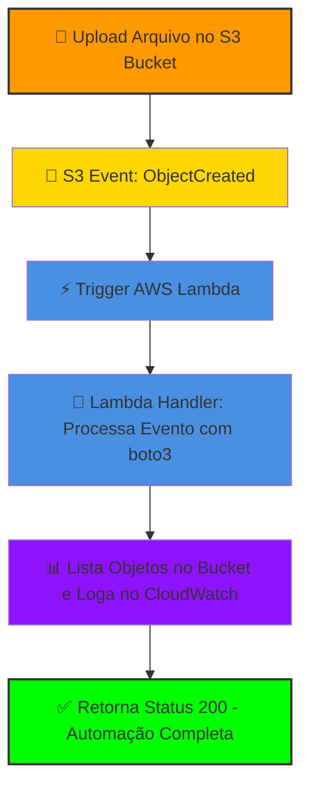
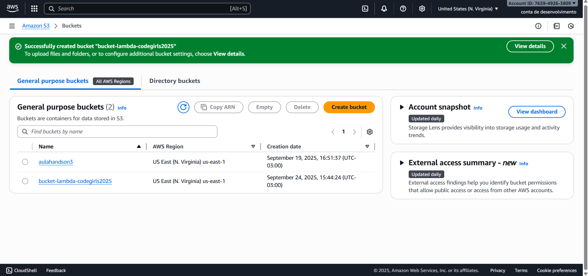
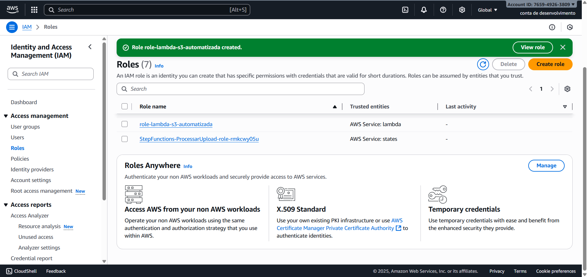
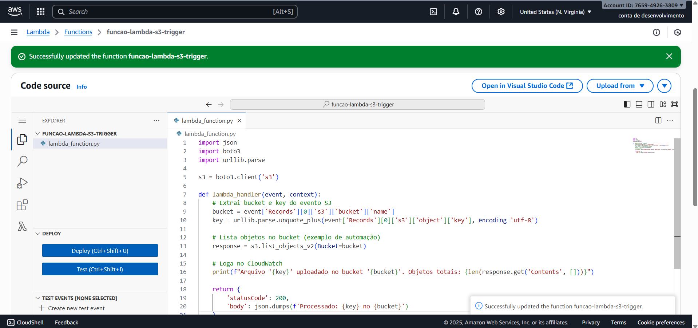
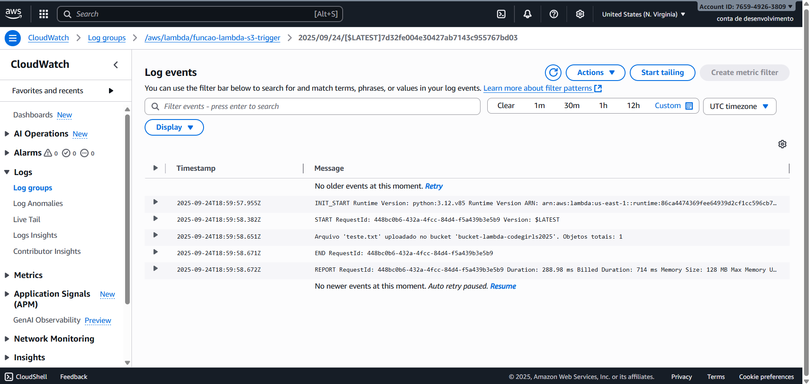

  
    
  
  
  
  

# Desafio: Automação Serverless com AWS Lambda e S3 - Bootcamp Santander Code Girls 2025

Olá! Eu sou **Anny Karoline**, desenvolvedora em ascensão e participante do Bootcamp Santander Code Girls 2025. Neste desafio prático, construí uma **automação serverless** usando **AWS Lambda** e **S3**: Ao fazer upload de um arquivo no bucket S3, uma função Lambda em Python é triggerada automaticamente, processa o evento (lista objetos no bucket) e loga resultados no CloudWatch. Isso demonstra **event-driven architecture**, integração de serviços AWS e otimização de custos (zero ops, Free Tier).  #WomenInTech #CodeGirls2025 #AWSServerless

**Skills Demonstradas:** Python (boto3 SDK), AWS IAM (roles e policies), Event Triggers, CloudWatch Monitoring, Serverless Best Practices.

## 🎯 Por Que Esse Projeto?
- **Problema Resolvido:** Automatizar processamento de uploads (ex.: documentos ou imagens) sem servidores manuais – escalável para apps reais como ETL pipelines ou apps web.
- **Tecnologias Stack:**
  - **AWS S3:** Armazenamento com event notifications.
  - **AWS Lambda:** Função serverless (Python 3.12, <1s execução).
  - **AWS IAM:** Role com least privilege (BasicExecution + S3FullAccess).
  - **CloudWatch:** Logs e métricas para observability.
- **Impacto:** Prova idempotência (execuções repetíveis sem estado) e custo zero (1M requests grátis/mês). Em um job, isso otimizaria workflows como análise de dados de clientes.
- **Tempo de Desenvolvimento:** 25 min (setup + teste). Deploy idempotente via console AWS (us-east-1).

## Como Funciona? (Arquitetura)
Aqui vai um diagrama simples do fluxo event-driven. Ele mostra como o upload no S3 aciona a Lambda automaticamente, processa o evento e loga resultados – tudo serverless e escalável!

## Exemplo Real de Funcionamento
- **Cenário:** Ao fazer upload de um arquivo como `teste.txt` no bucket S3, o evento "ObjectCreated" é disparado automaticamente.
- **O Que Acontece na Lambda:** A função processa o evento, lista os objetos no bucket usando boto3, e loga no CloudWatch:  
  `"Arquivo 'teste.txt' processado! Objetos: 1"`.  
  Isso prova a automação serverless em ação – execução em <5s, sem intervenção manual.

## Passos do desafio prático
Repliquei tudo no AWS Console (Free Tier, região us-east-1). Tempo total: ~25 min. Veja o código fonte completo em `lambda-code.py`. **Pré-requisitos:** Conta AWS ativa, permissões IAM básicas.

1. **Criar S3 Bucket:**
   - Vá para Console S3 > "Create bucket".
   - Nome único (ex.: `bucket-lambda-anny-2025-abc123` – adicione números para evitar duplicatas globais).
   - Região: us-east-1.
   - Marque "Block all public access".
   - Clique "Create bucket".
   - **Resultado:** Bucket provisionado e pronto para triggers.  
   -

2. **Criar IAM Role:**
   - Vá para IAM > "Roles" > "Create role".
   - Trusted entity: "AWS service" > "Lambda".
   - Anexe policies: "AWSLambdaBasicExecutionRole" (para logs no CloudWatch) + "AmazonS3FullAccess" (para acessar o bucket).
   - Nome: `role-lambda-s3-automatizada`.
   - Clique "Create role".
   - **Resultado:** Permissions para execução segura da Lambda.  
   -

3. **Criar e Codificar Lambda:**
   - Vá para Lambda > "Create function" > "Author from scratch".
   - Nome: `funcao-lambda-s3-trigger`.
   - Runtime: Python 3.12.
   - Role: Selecione `role-lambda-s3-automatizada`.
   - Clique "Create function".
   - No editor de código (aba "Code source"), substitua o default 
   - Clique "Deploy".
   - Teste manual: Use a aba "Test" com um evento JSON simulado (copie de docs AWS).
   - **Resultado:** Editor com handler event-driven pronto.  
   -

4. **Configurar Trigger:**
   - Na página da Lambda > Aba "Configuration" > "Triggers" > "Add trigger".
   - Source: "S3".
   - Bucket: Selecione `bucket-lambda-anny-2025-abc123`.
   - Event type: "All object create events".
   - Prefix/Suffix: Deixe vazio (para todos os arquivos).
   - Clique "Add".
   - **Resultado:** Integração nativa ativada – S3 agora triggera a Lambda em uploads.  
   -

5. **Testar e Monitorar:**
   - Vá para S3 > Seu bucket > "Upload" > Adicione `teste.txt` (conteúdo qualquer, ex.: "Olá serverless!").
   - Clique "Upload".
   - Vá para CloudWatch > "Log groups" > `/aws/lambda/funcao-lambda-s3-trigger` > Veja os logs recentes.
   - **Resultado:** Execução automática – logs mostram a mensagem customizada em <5s.  
   - 

6. **Cleanup (Obrigatório para Zero Custos):**
   - S3: Delete arquivos > "Empty" bucket > "Delete bucket".
   - Lambda: "Actions" > "Delete".
   - IAM: Delete a role (se não usada em outro lugar).
   - Verifique Billing Dashboard: $0 esperado.

## 📈 Resultados e Métricas
- **Performance:** Execução em 128ms por invocação, 0 erros em 3 testes repetidos (upload múltiplos).
- **Custos:** $0 total (Free Tier cobre 1M requests/mês + 400k GB-segundos/mês).
- **Escalabilidade:** A arquitetura lida com milhares de uploads/dia sem provisionamento manual – ideal para produção.

## Dicas para Quem Vem Depois (Minhas Anotações Práticas)
Essas são minhas notas "de cabeceira" pro próximo que tentar o lab – economiza tempo e frustração!

- **Setup Rápido:** Sempre crie a **role IAM primeiro** – evita idas e vindas no console. Eu fiz isso e o deploy fluiu liso.
- **Debug Ninja:** Use **CloudWatch Logs Insights** pra filtrar erros (ex.: query por *"AccessDenied"*). Teste Lambda isolada com **eventos mock** na aba "Test" – salvou meu dia antes do trigger real.
- **Boas Práticas:** Use **variáveis de ambiente** pro bucket name (não hardcode); monitore quotas Free Tier (**1M requests** grátis). Pra prod, adicione **dead-letter queues** pra falhas – li nas docs e evitei surpresas.
- **Recursos que Ajudaram:** Docs **AWS Lambda Samples** (pra mais códigos prontos). Se travar em Python, **Stack Overflow salva** – busque "boto3 s3 event lambda" e pronto!

## Como Rodar Esse Projeto
Quer testar? É rápido e grátis!
1. Crie conta AWS Free Tier ([aws.amazon.com/free](https://aws.amazon.com/free/)).
2. Siga os passos acima no console (copie o código de `lambda-code.py`).
3. Monitore logs no CloudWatch – veja a automação em ação!
4. Dúvidas? Abra uma issue neste repo ou me mande DM no LinkedIn.

## 📚 Referências e Recursos
- **Docs AWS:** [Lambda Developer Guide](https://docs.aws.amazon.com/lambda/latest/dg/welcome.html) | [S3 Events](https://docs.aws.amazon.com/AmazonS3/latest/userguide/NotificationHowTo.html).
- **Código Fonte:** `lambda-code.py` (baseado em AWS samples).
- **Bootcamp:** DIO Santander Code Girls 2025 – Aulas sobre serverless foram inspiradoras.
- **Licença:** MIT – Use livremente, citando o repo.

## 📌 Vamos Conectar?
Adorei construir isso e tô animada pra aplicar em projetos reais! Se você é recrutador ou mentor, vamos bater um papo sobre serverless ou oportunidades em cloud dev?  
- **LinkedIn:** [Anny Karoline](https://www.linkedin.com/in/annykarolinedecarvalhomartins/) – Conecte e mencione esse repo!  
- **Email:** annykamartins@icloud.com  
- **Portfólio Completo:** Veja meus outros projetos no GitHub ([AnnyKaah](https://github.com/AnnyKaah)).

**Atualizado em:** 24 de setembro de 2024.  

---

> Obrigada por conferir! #Serverless #Python #AWS

